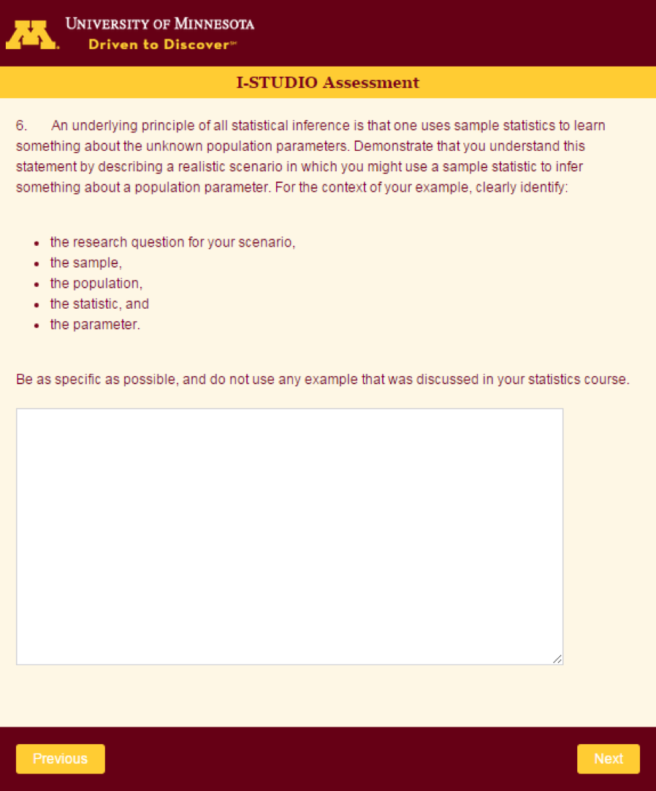
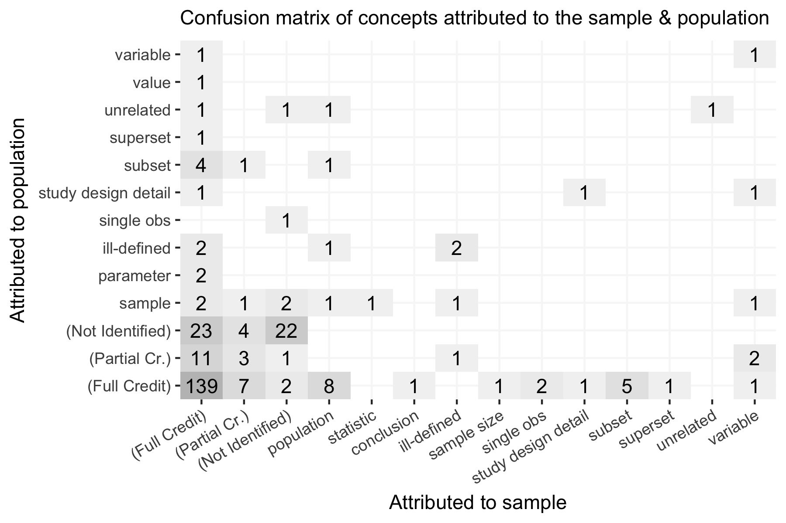
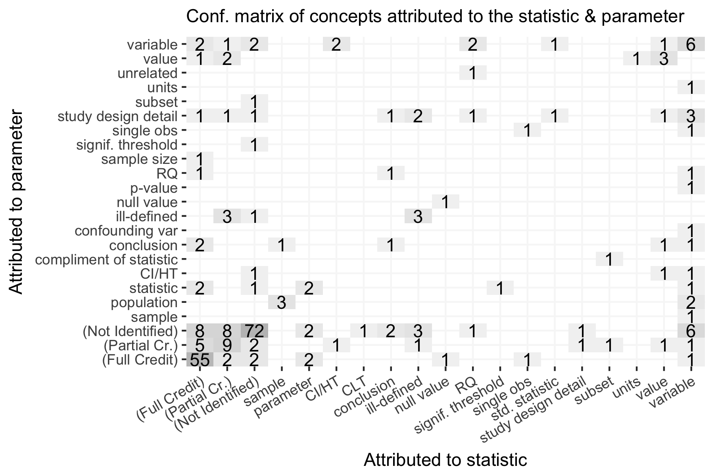
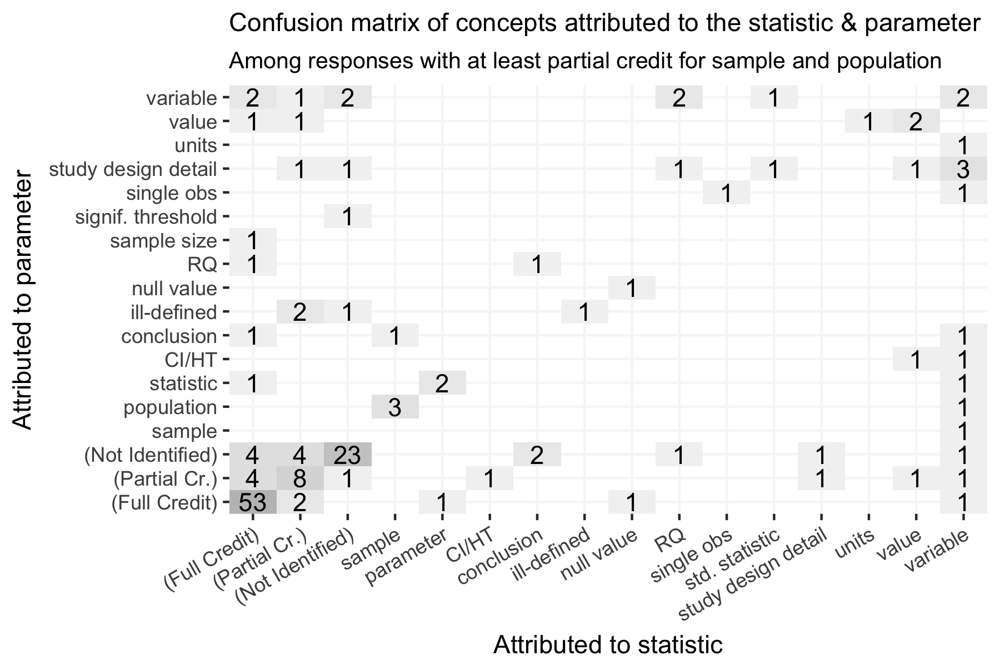

## Outline

- (5 mins) introduction/refresher
- (10-12 mins) Small groups (3) review a random subset of student work samples
- (0-5 mins) Large group sharing for observations about individual work samples reviewed 
- (10-15 mins) Discussion questions about implications for research, teaching, & assessment  

## Introduction 

Assessment tasks in introductory statistics often present data in context and ask students and describe an appropriate model. 

This study explores an alternative task adapted from Rossman & Chance (2001) [^1] that  
- explicitly presents an abstract model relating sample, population, statistic, & parameter, and then  
- prompts the student to assimilate these concepts into a context **of their own devising**. 

The study data consist of free-text narrative responses from a (inter)national sample of more than 1600 introductory statistics students from the United States (and one class section from the Netherlands).  

[^1]: Rossman, A. J., & Chance, B. L. (2001). *Workshop statistics: Discovery with data* (2nd ed.). Emeryville, CA: Key College Publishing.

## Rossman-Chance Task 

The RC task as it would have appeared to students during the ISTUDIO assessment:

 

## Objective

#### Goal

We want to explore what responses to the Rossman-Chance Task can tell us about teaching and learning related to emergent understanding of statistical models connecting data, chance, and context.

 

#### Definition
For the purpose of this study, “statistical model” can be understood to mean a statistical approximation designed to extract or explain the underlying structure of a data generating process (e.g., McCullagh, 2002; Graham, 2006) [^2] [^3]  

[^2]: McCullaugh, P. (2002). What is a Statistical Model? *The Annals of Statistics 30*(5), 1225-1310.
[^3]: Graham, A. (2006). *Developing thinking in statistics.* London: Sage. 

## Methods

- ISTUDIO Assessment developed and administered in May 2015  
    - 7 open-ended tasks with one or more parts  
    - Rossman-Chance task administered 6th  
    - ISTUDIO was administered electronically through a web-browser
    - Responses stored electronically as free text in a CSV
- Sample characteristics  
    - 14 different instructors  
    - 15 institutions  
    - 16 unique courses  
    - 29 total class sections  
- Scoring progress
    - simple random sample of 310 (and counting) out of 1622 
    - 259 clear attempts (includes context & apparent research question devised by student)

## Student Work Samples

- Work together in groups of 3 
- Everyone has a handout showing 9 student responses   
- Each group assigned a different subset to review 
    - **Please make notes in the Google Doc for each student as you review**
    - aim to complete 3, but please continue if time permits
    - try not to spend more than 3-4 min on any individual response
- focus on big picture (questions 2-4) rather than the nuance of what students attribute to each concept 
- After ~10 minutes we'll reconvene for large group discussion of: 
    - interesting observations from individual work samples
    - the nature of modeling & inference
    - implications for teaching & assessment

#### [Webpage link (Google Docs & Handout)](http://mdbeckman.github.io/SRTL-10/)

#### Questions while reviewing work samples (**please note remarks in Google Doc**):

1. To what concepts do students seem to attribute the sample, population, statistic, and parameter?
2. What does this say (if anything) about stages of development among students?
3. What does this say about emergent understanding related to modeling?
4. What does this say about emergent understanding related to inference?

## Discussion Questions 

#### Remarks about Individual Work Samples
- Overall remarks after reviewing student work samples?
- Particularly interesting work samples?

#### Modeling vs Inference

- What's the difference between inference and modeling? 
- Is it possible to understand inference, but not modeling? (please explain)
- Is it possible to understand modeling, but not inference? (please explain)

#### Implications 

- What does all of this mean (if anything) for **teaching practice**?
- What does all of this mean (if anything) for **assessment**?

## Backup Slides

## Confusion matrix: sample & population (n = 259)

## Confusion matrix: statistic & parameter (n = 259)

 

## Confusion matrix: statistic & parameter given sample & population (n = 259)

## 1. Amelia (R_3saVYW3fYN5W2mn)

> A random sample of 1000 U.S. adults were asked which Twix bar they preferred, the left Twix or the right Twix. 535 people said they like the left Twix better. Is this enough evidence to say that the population of U.S. adults have a preference between left Twix and right Twix?  /  / sample: 1000 U.S. adults / population: all U.S. adults / statistic: p hat = the sample proportion of 1000 U.S. adults that prefer left Twix = 535/1000 = 0.535 / parameter: p = the population proportion of all U.S. adults that prefer left Twix = unknown value / [ID: R_3saVYW3fYN5W2mn] 

#### Scoring Note

- scored as a complete response including reasonable identification of sample, population, statistic, and parameter

## 2. Benjamin (R_eWGvzQ7XsQDA6wp)

> A hypothetical scenario explores the rates of underage student drinking on campus.  /  / A survey was given to all students enrolled at a local university under the age of 21 asking about their drinking habits. Of the responses, a random sampling was obtained that was less than 10% of the total university population under the age of 21. The responses showed that an average of 82% of underage students at the local university drank alcohol. 

#### Scoring Note

- Sample, Population, Statistic OK
- Parameter missing

## 3. Charlotte (R_1pL3jlsrp2upGeP)

> Research question: does getting paid for school have an effect on grades? / sample: 30 students out of the each class of FSU's undergraduate population / population: FSU undergraduate population / Statistic: unsure what this means...maybe if grades were higher for those paid than unpaid / parameter:one semester

#### Scoring Note  

- Sample & Population OK
- Statistic => RQ; 
- Parameter => study design detail

## 4. Hunter (R_1HoPMWzhGDYPn7i)

> For this experiment we are going to look at the age at which students enter college in France regarding their gender. / The research question of this experiment is: what is the average age at which French students enter college, regarding gender in their country?  / The population is France students. The sample could be to take 10 female students in each college in France and 10 male students in each college in France. All should be in their first year and record their age, when they started and their. We use this sample to represent all the population.   / The independent variable age at which student enter college and the dependent variable is gender.   / To test this research question we would use an independent sample t-test, in order to do so we need to check the conditions, if they are met we can run the independent sample t-test. The conditions are: first the randomization condition, second the independence assumption, third the independent groups assumption and fourth the nearly normal condition.

#### Scoring Note

- Sample and Population are OK 
- No clear mention of statistic or parameter, but describes hypothesis test in some detail

## 5. Isla (R_1LNLLTccaJs25mx)

> What is the correlation between the amount of dog food a dog eats and weight gain. The population for this study would be all dogs in the United States with a sample of 5,000 healthy dogs. 

#### Scoring Note

- Sample and Population OK
- No mention of statistic or parameter at all

### 6. Jack (R_cYM0p7WZeWF8Ryx) 

> Finding out the average weight for all the ISU students in the College of Human Sciences. The population in this case would be all the ISU students in the College of Human Sciences and the parameter is the average weight. Since I want to know what the average weight is, I will have to ask every single ISU student in the College of Human Sciences what their weight is then take the average. But, since I don't have enough time to ask every single student at the College of Human Sciences I have to take the sample. Since the sample is a subgroup out of the population, so I would randomly ask ISU students in the College of Human Sciences, I will not pick the beginning students that walk through the door, I will randomly ask students. Then from the randomly chosen ISU students, i will calculate the average weight which is the statistic. Statistics can have errors, and change while the parameter does not change and is the true score. 

#### Scoring Note

- Sample, Population, Statistic OK
- Parameter => partial credit
- "true score" seems vague, and not explictly connected to population mean 

## 7. Liam (R_1QMxWMmq4n6w9nS) 

> Are more people following a spiritual path compared to organized religious path? /  / Sample will be drawn randomly from the population that answered my questionnaire. /  / The populations includes all people from various social media groups that answer my questionnaire. /  / Populations parameter would be what path do they follow either religious or spiritual path. /  / The statistic that will be used is hypothesis test and confidence interval.

#### Scoring Note

- Sample => partial
- Population => sample
- Statistic => HT/CI
- Parameter => variable 

## 8. Mia (R_1nPniNgSRzuM7TW)

> How many from a sample of 500 USA adults voted for President Barrack Obama in the election.  / Population- all adults in USA / Sample- 500 random USA adults / Statistic- from a sample of 500 USA adults, a percentage voted for Obama, real number / Parameter- population proportion of all USA adults that voted for Obama

#### Scoring Note

- scored as a complete response including reasonable identification of sample, population, statistic, and parameter

## 9. Olivia (R_2zMhPP9B18JSJzZ)

> We want to know the probability of a suburban household having a pet, and the number of pets each household contains. We would study a large amount of suburban households and observe whether or not each household has a pet, and how many. The population being so large, we would want a large sample size so as to increase out confidence in the results. Therefore we would sample over 30 houses and conduct a z-test with our results to find the probability of a household containing one, two, three, or 4 and above pets. 

#### Scoring Note

- Sample OK
- Population => partial
- no mention of statistic or parameter
- remarks about the need for a large sample size as an accommodation for a large population
- intends to use "z-test" to calculate probabilities for several events of interest

